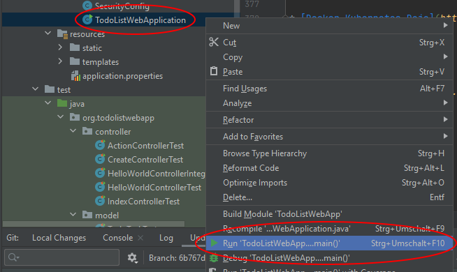
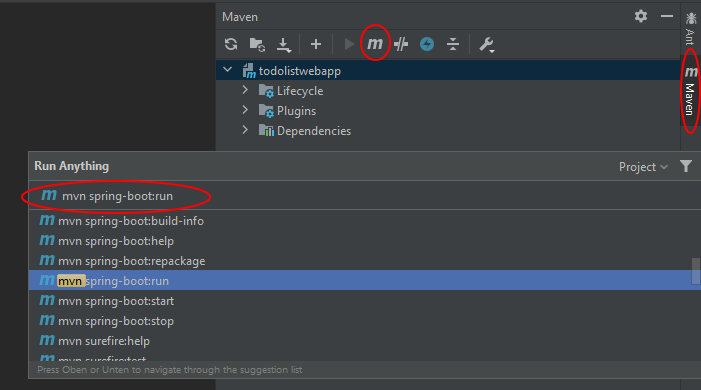

# Die Todolisten-WebApp

Die Todolisten-Webapp stellt eine Verwaltungsanwendung für Aufgaben da. Sie ist multitenant-fähig, d.h. kann von mehreren Personen gleichzeitig genutzt werden, ohne dass diese sich untereinander stören. Zusätzlich sind diverse Services eingebaut wie der Login über Google oder das Versenden von Emails über den Aufgabenstatus.

Die Applikation ist mithilfe von [Spring Boot](https://spring.io/projects/spring-boot) gebaut. Bei [Spring Boot](https://spring.io/projects/spring-boot) handelt es sich um ein Java-Framework, in welchem serverbasierte Anwendungen implementiert werden können. Dabei folgt es dem Prinzip [Konvention vor Konfiguration (convention over configuration)](https://en.wikipedia.org/wiki/Convention_over_configuration), indem die einzelnen Module des Frameworks mit einer Default-Konfiguration versehen worden sind und der Entwickler nur bei Änderungen eingreifen muss. Dies ist ein Unterschied zu dem Standard-[Spring-Framework](https://spring.io/projects/spring-framework), wo der Entwickler selbst für die komplette Konfiguration zuständig ist.

# Aufbau des Beispielprojektes

## Initialisierung mithilfe von Spring Starter

Spring Boot lässt sich sehr einfach initialisieren, indem die Webseite [Spring Initializr](https://start.spring.io/) genutzt wird. Hier werden die Grundeinstellungen, welches Build-Tool, welche Programmiersprache in welcher Version, welche Spring-Boot-Version genutzt und welche Benennung das Projekt besitzen soll, angegeben. Zusätzlich lassen sich die einzelnen Module von Spring Boot wählen, die eingebunden werden sollen. Mit einem _Ctrl-Enter_ lässt sich eine ZIP-Datei herunterladen, die sich in die Entwicklungsumgebung laden lässt. Dies ist der Grundaufbau des Projektes.

Grundsätzlich lässt sich eine Spring-Boot-Applikation auch lokal über die Kommandozeile mit _spring init_ initalisieren. Einige Entwicklungsumgebungen geben ähnliche Hilfestellungen. Es ist auch möglich eine Spring-Boot-Applikation völlig per Hand aufzubauen.

Für den nächsten Abschnitt haben wir Java als Programmiersprache gewählt, Version 11 angegeben, Maven als Buildtool selektiert und die web-Unterstützung konfiguriert. Des Weiteren haben wir die Benennungsparameter des Projektes angegeben.


## Spring Boot basiert auf Maven

Spring Boot wird mit Hilfe von Maven oder Gradle gesteuert. Für Maven ist die zentrale Datei, die Datei [pom.xml](pom.xml), in welcher die  gelistet sind.

Erster wichtiger Teil dieser Datei ist die Referenz auf das Parent-Pom _spring-boot-starter-parent_. Hierdurch wird die Spring-Boot-Unterstützung aktiviert. Hier befindet sich auch die Versionsnummer von Spring Boot.
```xml
<parent>
	<groupId>org.springframework.boot</groupId>
	<artifactId>spring-boot-starter-parent</artifactId>
	<version>SPRING_BOOT_VERSIONSNUMMER</version>
	<relativePath/>
</parent>
```
Im Folgenden finden sich Parameter, die bei der Initialisierung angegeben worden sind:

```xml
<groupId>org.todolistwebapp</groupId>
<artifactId>todolistwebapp</artifactId>
<version>0.0.1-SNAPSHOT</version>
<name>todolistwebapp</name>
<description>Beispielprojekt einer einfachen Spring-Boot-Anwendung, 
die eine Todo-Listen-Verwaltung darstellt</description>
<properties>
    <java.version>11</java.version>
</properties>
```

Im nächsten Abschnitt werden die einzelnen Module von Spring-Boot eingebunden. Dieser Abschnitt kann beispielsweise wie folgt aussehen. Hier wird das Web-Modul eingebunden, welche die Zugriffe über HTTP(S) unterstützt.

```xml
<dependencies>
	<dependency>
		<groupId>org.springframework.boot</groupId>
		<artifactId>spring-boot-starter-web</artifactId>
	</dependency>
</dependencies>
```

Für das Testing befindet sich folgender Abschnitt in den Dependencies:

```xml
<dependency>
	<groupId>org.springframework.boot</groupId>
	<artifactId>spring-boot-starter-test</artifactId>
	<scope>test</scope>
	<exclusions>
		<exclusion>
			<groupId>org.junit.vintage</groupId>
			<artifactId>junit-vintage-engine</artifactId>
		</exclusion>
	</exclusions>
</dependency>
```

Eine Referenz auf das Maven-Plugin für Spring-Boot darf nicht fehlen. Dadurch werden die Maven-Befehle für Spring-Boot verfügbar:

```xml
<build>
  <plugins>
    <plugin>
        <groupId>org.springframework.boot</groupId>
        <artifactId>spring-boot-maven-plugin</artifactId>
    </plugin>
  </plugins>
</build>
```

## Die Applikation

Die Startup-Datei einer Spring-Boot-Applikation, die auch in unserem Falle mitgeneriert wurde, sieht im einfachsten Falle wie folgt aus: 

```java
@SpringBootApplication
public class TodoListWebApplication {
	public static void main(String[] args) {
		SpringApplication.run(TodoListWebApplication.class, args);
	}
}
```

Dazu kommt ein mitgenerierter Controller, der unter dem Pfad `/helloworld` den unten angegebenen String ausgibt. Der Controller ist im Folgenden leicht angepasst:

```java
@RestController
public class HelloWorldController {
    @RequestMapping("/helloworld")
    public String index() {
        return "Hello World! Dies ist eine Beispiel-Spring-Boot Applikation";
    }
}
```

## Die Tests

Auch ein erster Test ist innerhalb der Applikation generiert worden. Er befindet sich im `test`-Verzeichnis in demselben Package. Er wird wie folgt angepasst:

```java
@SpringBootTest(webEnvironment = SpringBootTest.WebEnvironment.RANDOM_PORT)
public class HelloWorldControllerIntegrationTest {

    @LocalServerPort
    private int port;

    @Autowired
    private TestRestTemplate restTemplate;

    @Test
    public void testReturnsTheString() {
        ResponseEntity<String> responseEntity = this.restTemplate.getForEntity("http://localhost:" + port + "/helloworld",
                String.class);
        assertEquals(200, responseEntity.getStatusCodeValue());
    }
}
```

Der Test sorgt dafür, den in Spring eingebauten Server inklusive der Spring-Applikation hochzufahren. Dann wird der Server mit einem REST-Call betestet, ob das korrekte Ergebnis zurückgeliefert wird.

Der Parameter `webEnvironment = SpringBootTest.WebEnvironment.RANDOM_PORT` sorgt dafür, dass ein freier Zufallsport für die Lokation des Servers genutzt wird. Dieser Port wird über die Annotation `@LocalServerPort` in den Test injiziert. Die Annotation `@Test` kennzeichnet den Test als Test.

Der Test lässt sich in der IDE (hier am Beispiel von Jetbrains IntelliJ gezeigt) mit einem Rechtsklick auf den Dateinamen `HelloWorldControllerIntegrationTest` und dann Klick auf `Run HelloWorldControllerIntegrationTest` starten. Alternativ können auch die grünen Pfeile an der Testklasse oder dem Test genutzt werden. In anderen IDEs geschieht das Starten des Tests ähnlich:


# Start der Applikation

## Aus der Entwicklungsumgebung

Die Applikation lässt sich direkt aus der IDE mit einem Rechts-Klick auf die Applikation und dann `Run` starten:



## Von der Kommandozeile

Auch von der Kommandozeile lässt sich die Applikation starten. Hierzu muss zunächst die Applikation mit `mvn package` gebaut worden sein. Danach befindet sich im `target`-Ordner des Projektes eine JAR-Datei, die wie folgt ausgeführt werden kann.  

```text
cd target
java -jar todolistwebapp-0.0.1-SNAPSHOT.jar
```

## Mit Hilfe von Maven

Auch mit Maven kann die Applikation gestartet werden:

```text
mvn spring-boot:run
```

Dies kann über das Maven-Menü auf der rechten Seite von IntelliJ geschehen. Hierzu wird zunächst das Maven-Menü aufgeklappt, dann das Maven-m in der Menüzeile angeklickt und zuletzt `mvn spring-boot:run` angegeben und mit Enter quittiert:



## Als Docker-Container

Ist Docker lokal installiert, kann mithilfe von 

```text
docker run -p8080:8080 ctornau/todolistwebapp
```

das automatisch generierte Docker-Image heruntergeladen und gestartet werden. Dabei handelt es sich nicht anders als bei den anderen Startmöglichkeiten um einen Build, der auf der lokalen Version basiert, sondern der auf der im Repository eingecheckten.

## Innerhalb eines Kubernetes-Clusters

Weiter unten ist beschrieben, wie die Applikation innerhalb eines Kubernetes-Clusters betrieben werden kann.

## Zusätzlich erforderlich für den Start der Applikation

Es ist darauf zu achten, dass in jedem Fall ein MySQL-Server bzw. MariaDB-Server lokal installiert und gestartet ist. Weiterhin ist MongoDB in einer Default-Konfiguration nötig.

## Aufruf der Applikation

In jedem Fall ist die Applikation unter [http://localhost:8080/helloworld](http://localhost:8080/helloworld) verfügbar.

# UI mit Thymeleaf

## Einbindung mit Maven im pom.xml

Bei Thymeleaf handelt es sich um eine Templatesprache, welche es ermöglicht, HTML-Seiten mit Werten aus Modell-Objekten zu befüllen. Thymeleaf muss zunächst in die Dependencies eingebunden werden: 

```xml
<dependencies>
	<dependency>
		<groupId>org.springframework.boot</groupId>
		<artifactId>spring-boot-starter-thymeleaf</artifactId>
	</dependency>
</dependencies>
```

## Das Template-Verzeichnis und das Thymeleaf-Template

Innerhalb des Verzeichnisses `src/main/resources` wird ein Template-Verzeichnis `templates` angelegt. In dieses Template-Verzeichnis werden Template-Dateien für Thymeleaf hinterlegt.

Innerhalb des Verzeichnisses `templates` befindet sich die Datei `index.html`. Diese beinhaltet Thymeleaf-Tags:

```html
<!doctype html>
<html lang="de" xmlns:th="http://www.thymeleaf.org">
<head>
    ...
    <link rel="stylesheet" th:href="@{/bootstrap/css/bootstrap.min.css}">
</head>
<body>
 <table>
    ...
    <tr th:each="todotask: ${tasks}">
        <td th:text="${todotask.name}">Todotask Name</td>
        <td th:text="${#calendars.format(todotask.creationTime,'dd. MMMM yyyy')}"></td>
        <td th:text="${#calendars.format(todotask.startTime,'dd. MMMM yyyy')}"></td>
        <td th:text="${#calendars.format(todotask.finishTime,'dd. MMMM yyyy')}"></td>
        <td th:text="${todotask.state.displayValue}"></td>
    </tr>
    ...
 </table>
</body>
``` 

# Bootstrap und DataTables von jQuery

Das Framework [Bootstrap](https://getbootstrap.com/) ist ein Aufsatz auf die Darstellung von HTML und CSS innerhalb eines Browsers. Es sorgt für ein uniformes Bild über verschiedene aktuelle Browser hinweg und bietet Erweiterungen zur Sprache an, so dass sich Webseiten relativ schnell zusammenstellen lassen. Innerhalb der HTML-Dateien ```index.html``` und weiteren wird Bootstrap genutzt.

Weiterhin kommt die Erweiterung [DataTables](https://www.datatables.net/) zum Einsatz. Diese ermöglicht es HTML-Tabellen interaktiv im Browser darzustellen. Durch DataTables erscheint im finalen Programm eine Tabelle, die sich sortieren und durchblättern lässt.


# Spring Data JPA

Innerhalb von Spring Boot lässt sich mithilfe von Spring Data ein Zugang zu einer Datenbank realisieren. 

Um Spring Data zu nutzen, muss es via Dependency in der ```pom.xml``` eingebunden werden:

```xml
<dependencies>
    <dependency>
       <groupId>org.springframework.boot</groupId>
       <artifactId>spring-boot-starter-data-jpa</artifactId>
    </dependency>
</dependencies>
```

Die Spring Data JPA stellt dabei ein sogenanntes Repository zur Verfügung, welches als DAO (Data Access Object) fungiert. Dabei muss die Klasse nicht selbst geschrieben werden, sondern sie wird von Spring Boot Data JPA selbständig aus dem Interface generiert:

```java
package org.todolistwebapp.repository;

import org.springframework.data.jpa.repository.JpaRepository;
import org.springframework.stereotype.Repository;
import org.todolistwebapp.model.TodoTask;

import java.util.List;

@Repository
public interface TodoTaskRepository extends JpaRepository<TodoTask, Long> {
    List<TodoTask> findByOwner(String owner);
}
```

Das JpaRepository stellt die unterschiedlichsten Möglichkeiten bereit, auf die Daten der Tabelle zuzugreifen. Für uns wichtig ist die ```findAll()```-Methode, welche alle Datensätze liefert, wie die ```getOne(long id)```-Methode, welche anhand der ID einen Datensatz aus der Datenbank liefert.

Im Hintergrund ist das Beispielprojekt so konfiguriert, dass auf eine Datenbank [MariaDB](https://mariadb.org/) zugegriffen wird, die lokal zu installieren ist, um die Applikation zu starten.

Der Treiber für die Datenbank muss über eine Dependency in der ```pom.xml``` eingebunden werden:

```xml
<dependencies>
    <dependency>
        <groupId>org.mariadb.jdbc</groupId>
        <artifactId>mariadb-java-client</artifactId>
        <version>2.6.0</version>
    </dependency>
</dependencies>
```

Für die Tests ist eine andere Dependency konfiguriert, damit ohne das Hochfahren von MariaDB getestet werden kann:

```xml
<dependencies>
    <dependency>
        <groupId>com.h2database</groupId>
        <artifactId>h2</artifactId>
        <version>1.4.200</version>
        <scope>test</scope>
    </dependency>
</dependencies>
```

Innerhalb der ```application.properties``` befinden sich die Konfiguration von Spring Data wie auch die Credentials der Datenbank:

```xml
spring.datasource.url=jdbc:mariadb://localhost:3306/springbootdb
spring.datasource.username=root
spring.datasource.password=
spring.jpa.generate-ddl=true
```

Die Datenbank ```springbootdb``` muss manuell hinzugefügt werden, damit Spring Boot hier die entsprechenden Daten ablegen kann. 

# Spring Security

Die meisten Applikationen erfordern ein Login: Nicht jeder darf auf alle Daten der Applikation zugreifen. Auch hier hat Spring Boot eine Möglichkeit, Zugriffe zu konfigurieren: Spring Boot Security. 

Wir nutzen Spring Boot Security, um eine OAuth2-Authentifizierung durchzuführen. Dabei wird der Benutzer nicht lokal gegen ein Passwort authentifiziert, sondern von einem OAuth2-Provider wie bspw. Google.

Spring Boot Security wird wie folgt in der ```pom.xml``` eingebunden:

```xml
 <dependencies>
     <dependency>
        <groupId>org.springframework.boot</groupId>
        <artifactId>spring-boot-starter-security</artifactId>
     </dependency>
     <dependency>
        <groupId>org.springframework.security</groupId>
        <artifactId>spring-security-test</artifactId>
        <scope>test</scope>
        </dependency>
 </dependencies>
 ```

Innerhalb der ```pom.xml``` sind noch weitere Libraries eingebunden, die noch nicht von Spring Boot Security gegriffen werden, aber für eine OAuth2-Authentifzierung benötigt werden. 

Die Datei ```SecurityConfig.java``` übernimmt die Konfiguration der Spring Boot Security. Zusätzlich werden in den ```application.properties``` Schnlüssel angelegt, die über die [Credentials Console](https://console.developers.google.com/apis/credentials) in diesem Fall von Google bezogen werden können:

```text
spring.security.oauth2.client.registration.google.clientId=die-client-id.apps.googleusercontent.com
spring.security.oauth2.client.registration.google.clientSecret=das-secret
```

Diese Werte werden durch die Kubernetes-Environment-Variablen, sollte ein Kubernetes-Deployment stattfinden, überschrieben (in ```k8s/springboot/deployment.yaml```):

```yaml
- name: spring.security.oauth2.client.registration.google.clientId
  value: die-client-id.apps.googleusercontent.com
- name: spring.security.oauth2.client.registration.google.clientSecret
  value: das-secret
```

# Email-Versenden mit SendGrid

Der Dienst [SendGrid](https://sendgrid.com/) ist ein Cloud-Dienst zum Versenden von Emailnachrichten. Theoretisch wäre es möglich, von jedem beliebigen Rechner Emailnachrichten zu versenden. Jedoch schützen sich die meisten Empfängerserver mittlerweile vor Emails von zuvor unbekannten IP-Adressen und führen auch weitere Schutzmaßnahmen durch, um Spam zu unterdrücken. Deshalb nutzt man am besten einen entsprechenden Dienst, der den Versand der Emails managt. 

Innerhalb der ```pom.xml``` ist die Bibliothek von SendGrid wie folgt eingebunden: 

```xml
 <dependencies>
	<dependency>
		<groupId>com.sendgrid</groupId>
		<artifactId>sendgrid-java</artifactId>
		<version>4.0.1</version>
	</dependency>
 </dependencies>
 ```

Innerhalb der ```application.properties``` müssen der dort zur Verfügung gestellte API-Key eingetragen werden. Ebenso muss über SendGrid die Absenderadresse verifiziert werden und eingetragen werden: 

```text
sendgrid.apikey=der-Key
sendgrid.senderemailaddress=die-absenderadresse@somewhere.com
```

Auch diese Werte werden bei einem Kubernetes-Deployment durch die Environment-Variablen (in ```k8s/springboot/deployment.yaml```) überschrieben:

```yaml
- name: sendgrid.apikey
  value: key-von-sendgrid
- name: sendgrid.senderemailaddress
  value: verifizierte-emailadresse-bei-sendgrid
```

# Deployment unter Kubernetes (K8s)

Im Folgenden wird nun ein Kubernetes-Deployment der Applikation auf einem beliebigen Kubernetes-Cluster aufgebaut.

## Deployment von MariaDB

Kubernetes- __Deployment__ von MariaDB mithilfe von  

```kubectl run mariadb --image=mariadb:latest --env="MYSQL_ROOT_PASSWORD=pass!word" --env="MYSQL_DATABASE=springbootdb" --port=3306```

Das Command ```kubectl get pods``` zeigt einen __Pod__:

```text
NAME                       READY   STATUS    RESTARTS   AGE
mariadb-67fb996878-q5qmm   1/1     Running   0          2m28s
```

Mithilfe von ```kubectl delete pod mariadb-***``` lässt sich der __Pod__ entfernen. Dies wird von Kubernetes erkannt und als ausgleich sogleich ein neuer Pod gestartet. Dies kann mit ```kubectl get pods``` geprüft werden, wo sich der Pod-Name und die Zeit nun verändert haben sollten. 

Mithilfe von 

```kubectl get deployment mariadb -o yaml > k8s/mariadb/deployment.yaml```

lässt sich das __Deployment__ in einer YAML-Datei persistieren (Das Verzeichnis ```k8s/mariadb``` muss dazu existieren). 

Das __Deployment__ kann mit ```kubectl delete deployment mariadb``` wieder entfernt werden.

Wir editieren die Datei, so wie sie im Git-Repository schon hinterlegt ist. Mit dem Befehl ```kubectl apply -f k8s/mariadb/deployment.yaml``` lässt sich das __Deployment__ aus der editierten YAML-Datei (im Git-Repository schon hinterlegt) wieder einspielen. Ein neuer __Pod__ wird wieder gestartet. Dies kann mit ```kubectl get pods``` geprüft werden. 

## Zugriff über einen Service in Kubernetes

Mithilfe eines Services kann auf MariaDB zugegriffen werden. Wir deployen einen Service mit Cluster-IP, der dafür sorgt, dass Kubernetes-Intern MariaDB aufgerufen werden kann. Der Service ist in der Datei ```service.yaml``` hinterlegt:

```kubectl apply -f k8s/mariadb/service.yaml```

Mit ```kubectl get service``` lassen sich installierte Services im Kubernetes-Cluster anzeigen:

```text
NAME         TYPE        CLUSTER-IP   EXTERNAL-IP   PORT(S)    AGE
kubernetes   ClusterIP   10.96.0.1    <none>        443/TCP    3d7h
mariadb      ClusterIP   None         <none>        3306/TCP   10m
```

Nun starten wir ein weiteres Deployment, welches über den MariaDB-Client auf der Kommandozeile auf den MariaDB-Server zugreift:

```kubectl run -it --rm --image=mariadb:latest --restart=Never mariadb-client -- mariadb -h mariadb -ppass!word```

Mit ```show databases;``` lässt sich die Liste der Datenbanken anzeigen und wir erkennen, dass die Datenbank ```springbootdb``` angelegt worden ist:

```text
+--------------------+
| Database           |
+--------------------+
| information_schema |
| mysql              |
| performance_schema |
| springbootdb       |
+--------------------+
4 rows in set (0.000 sec)
```

## MongoDB Deployment

Das __Deployment__ der Datenbank MongoDB verhält sich ähnlich.

Mit dem Kommando

```kubectl apply -f k8s/mongodb/deployment.yaml```

wird der __Pod__ deployt.

Dieser __Pod__ erhält einen __Service__ mit:

```kubectl apply -f k8s/mongodb/service.yaml```

## Konfiguration und Deployment der Spring-Boot-Anwendung

Möchte man seine eigenen Änderungen testen, so ist das Docker-Image wie folgt zu bauen:

```docker build . -t todolistwebapp:1```

Bei eigenen Änderungen muss das referenzierte Docker-Image in ```k8s/springboot/deployment.yaml``` angepasst werden. Hier ist das öffentliche Image des Builds standardmäßig angegeben. Dann kann ein __Deployment__ wie folgt erfolgen:  

```kubectl apply -f k8s/springboot/deployment.yaml```

Das __Deployment__ kann verifiziert werden:

```kubectl get pods```

Es sollte in etwa diese Ausgabe zu sehen sein: 

```text
NAME                              READY   STATUS    RESTARTS   AGE
mariadb-7999774f68-ml2sl          1/1     Running   0          6h26m
mongodb-665d847848-sd42p          1/1     Running   0          100m
todolistwebapp-5c7c8d49f5-kzr4w   1/1     Running   0          56m
```

Die Pod-internen Logs lassen sich wie folgt anzeigen:

```kubectl logs todolistwebapp-5c7c8d49f5-kzr4w```

Man erkennt an der folgenden Ausgabe ```Started TodoListWebApplication in 4.415 seconds```, dass der Start erfolgreich war:

```text
2020-08-15 16:23:22.665  INFO 1 --- [           main] o.s.b.a.w.s.WelcomePageHandlerMapping    : Adding welcome page template: index
2020-08-15 16:23:22.675  INFO 1 --- [         task-1] o.h.e.t.j.p.i.JtaPlatformInitiator       : HHH000490: Using JtaPlatform implementation: [org.hibernate.engine.transaction.jta.platform.internal.NoJtaPlatform]
2020-08-15 16:23:22.688  INFO 1 --- [         task-1] j.LocalContainerEntityManagerFactoryBean : Initialized JPA EntityManagerFactory for persistence unit 'default'
2020-08-15 16:23:22.847  INFO 1 --- [           main] o.s.b.w.embedded.tomcat.TomcatWebServer  : Tomcat started on port(s): 8080 (http) with context path ''
2020-08-15 16:23:22.850  INFO 1 --- [           main] DeferredRepositoryInitializationListener : Triggering deferred initialization of Spring Data repositories…
2020-08-15 16:23:23.014  INFO 1 --- [           main] DeferredRepositoryInitializationListener : Spring Data repositories initialized!
2020-08-15 16:23:23.025  INFO 1 --- [           main] o.todolistwebapp.TodoListWebApplication  : Started TodoListWebApplication in 4.415 seconds (JVM running for 5.313)
```

## Ingress - Zugriff von extern

Unsere Spring-Boot-Applikation soll von extern erreicht werden können. Kubernetes bietet mehrere Möglichkeiten, dies zu bewerkstelligen. Wir wählen die Möglichkeit des Ingress. Hier befindet sich innerhalb von Produktionsumgebungen LoadBalancer vor der Applikation, die den Traffic aufteilen. 

Doch zunächst muss ein Service erstellt werden:

```kubectl apply -f k8s/springboot/service.yaml```

Dann erzeugen wir mit dem folgenden Befehl einen Nginx Ingress. Nginx ist ein Webserver, der sich auch als Reverse-Proxy benutzen lässt:

```kubectl apply -f https://raw.githubusercontent.com/kubernetes/ingress-nginx/master/deploy/static/provider/cloud/deploy.yaml```

Mit Hilfe des folgenden Befehls lässt sich anzeigen, ob der Ingress korrekt eingerichtet worden ist:

```kubectl -n ingress-nginx get pod,service```

Die Ausgabe sollte in etwa wie folgt aussehen:

```text
NAME                                            READY   STATUS      RESTARTS   AGE
pod/ingress-nginx-admission-create-2bh27        0/1     Completed   0          23s
pod/ingress-nginx-admission-patch-xzvcp         0/1     Completed   1          23s
pod/ingress-nginx-controller-77f5884bdd-mfqw4   1/1     Running     0          23s

NAME                                         TYPE           CLUSTER-IP      EXTERNAL-IP   PORT(S)                      AGE
service/ingress-nginx-controller             LoadBalancer   10.96.255.145   localhost     80:31110/TCP,443:31396/TCP   23s
service/ingress-nginx-controller-admission   ClusterIP      10.98.124.103   <none>        443/TCP                      23s
```

Nun muss dem Nginx-Server mitgeteilt werden, unter welcher URL er die hereinkommenden Requests routen soll. Dies wird wie folgt getan:

```kubectl apply -f k8s/springboot/ingress.yaml```

Nun sollte die Application unter der URL http://localhost:80 lokal erreichbar sein. Ggf. muss OAuth2 zusätzlich konfiguriert werden, dass auch von der neuen URL Requests entgegengenommen werden. 

# Weitere Dokumentation

## Spring Boot

* [Spring Boot](https://docs.spring.io/spring-boot/docs/2.3.0.RELEASE/reference/htmlsingle/)
* [Spring Web](https://docs.spring.io/spring-boot/docs/2.3.0.RELEASE/reference/htmlsingle/#boot-features-developing-web-applications)
* [Building a RESTful Web Service](https://spring.io/guides/gs/rest-service/)
* [Serving Web Content with Spring MVC](https://spring.io/guides/gs/serving-web-content/)
* [Building REST services with Spring](https://spring.io/guides/tutorials/bookmarks/)

## Docker und Kubernetes

* [Docker Docs](https://docs.docker.com/)
* [Docker Kubernetes Dojo](https://github.com/javaplus/DockerKubesDojo)

# Impressum

[Impressum](http://www.tornau.name)

